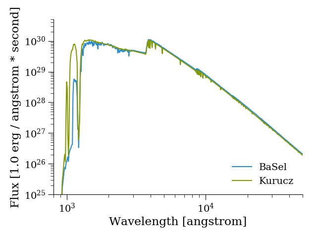
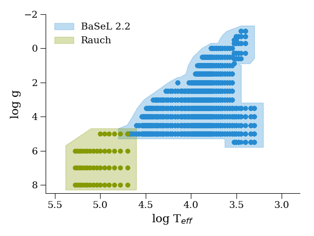

.. pystellibs documentation master file, created by
   sphinx-quickstart on Mon Oct 17 14:28:28 2016.
   You can adapt this file completely to your liking, but it should at least
   contain the root `toctree` directive.

pystellibs - making synthetic spectra
======================================

This is a set of tools to compute synthetic spectra in a simple way, ideal to
integrate in larger projects.

This package provides a common interface to compute a single or a collection of
spectra using spectral libraries or atmospheres.

Package main content
~~~~~~~~~~~~~~~~~~~~

The main package articulates around 2 parts:

* :class:`pystellibs.stellib.Stellib` a stellar spectra library, commonly normalized to
  bolometric luminosities
* :class:`pystellibs.stellib.AtmosphereLib` a stellar atmosphere library, commonly normalized to
  stellar radii.

The interpolation within libraries is left as a separated component.

This package provides already multiple input libraries:

* :class:`pystellibs.basel.BaSeL`: BaSeL 2.2, ~ Atlas 9 empirically recalibrated (Leujeune et al 1998)
* :class:`pystellibs.rauch.Rauch`: a White dwarf library
* :class:`pystellibs.kurucz.Kurucz`: Castelli and Kurucz 2004 or ATLAS9
* :class:`pystellibs.tlusty.Tlusty`: NLTE O, B stars [Lanz, T., & Hubeny, I. (2003)]
* :class:`pystellibs.elodie.Elodie`: version 3.1, high resolution optical library.
* :class:`pystellibs.munari.Munari`: extended ATLAS9 stellar atmospheres (Munari et al.  2005 A&A 442 1127)
* :class:`pystellibs.btsettl.BTSettl`: BT-Settl Library (Allard, Hauschildt and Schweitzer 2000)

Future libraries to be included:

* XSL: Xshooter spectral library
* PHOENIX
* MARCS

References (TBU)
----------------

* Leujeune et al 1998: http://cdsads.u-strasbg.fr/abs/1998yCat..41300065L

API
~~~

The API has been reduced to minimum to make it easy to use. Mostly 2 functions:

* :func:`Stellib.generate_stellar_spectrum`
  that computes one spectrum for one set of stellar parameters
* :func:`Stellib.generate_individual_spectra`
  that computes a spectrum for each of many sets of paramaters

Contents:

.. toctree::
   :maxdepth: 2

   modules

Quick Start
~~~~~~~~~~~

* This example shows how to use one of 2 libraries to compute a spectrum

.. code-block:: python

        import pylab as plt
        from pystellibs import BaSeL, Kurucz

        # load 2 libraries
        basel = BaSeL()
        kurucz = Kurucz()
        ap = (4., 3.5, 0., 0.02)
        sb = basel.generate_stellar_spectrum(*ap)
        sk = kurucz.generate_stellar_spectrum(*ap)
        plt.figure()
        plt.loglog(osl._wavelength, sb, label='BaSel')
        plt.loglog(osl._wavelength, sk, label='Kurucz')
        plt.legend(frameon=False, loc='lower right')
        plt.xlabel("Wavelength [{0}]".format(basel.wavelength_unit))
        plt.ylabel("Flux [{0}]".format(basel.flux_units))
        plt.xlim(800, 5e4)
        plt.ylim(1e25, 5e30)
        plt.tight_layout()

* Combining multiple libraries (with priority): the following example combines
  BaSeL with white-dwarf models.

.. code-block:: python

        from pystellibs import BaSeL, Rauch

        # Combine 2 libraries by priority order
        lib = BaSeL() + Rauch()

        for osl in lib._olist:
            l = plt.plot(osl.logT, osl.logg, 'o')[0]
            osl.plot_boundary(color=l.get_color(), dlogT=0.1, dlogg=0.3, alpha=0.3,
                              label=osl.name)

        plt.xlim(5.6, 2.8)
        plt.ylim(8.5, -2)
        plt.xlabel('log T$_{eff}$')
        plt.ylabel('log g')
        plt.tight_layout()

        plt.legend(frameon=False, loc='upper left')

Indices and tables
==================

* :ref:`genindex`
* :ref:`modindex`
* :ref:`search`
